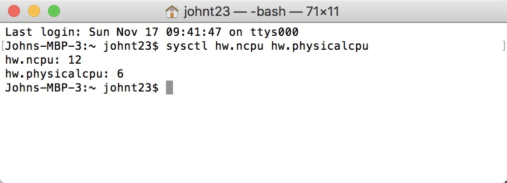

class: center, middle

```{r setup, include=FALSE}
options(htmltools.dir.version = FALSE)
knitr::opts_chunk$set(echo = FALSE, fig.align = "center")
```

# BIG problems...
---
```{r}
knitr::include_graphics("images/Levi et al 2016.png")
```
.footnote[From Levi et al. 2016 [doi:10.5063/F1Z899CZ](https://knb.ecoinformatics.org/view/doi:10.5063/F1Z899CZ)]
???
_here’s a 2 TB (that’s Terabyte) set of modeled output data from Ofir Levy et al. 2016 that models 15 environmental variables at hourly time scales for hundreds of years across a regular grid spanning a good chunk of North America_
_There are over 400,000 individual netCDF files in the Levy et al. microclimate data set. Processing them would benefit massively from parallelization_

---
class: center, middle
# SLOW problems...

---
class: center, middle
<video autosize: true controls>
  <source src="images/Model_run.mov">
</video>
???
_Gotta get this video working or find some other visual. Basically bring up running thousands of simulations_

---
class: left, top
# In this class:

### How does parallelization occur?

### Parallelizing in R with focus on `doParallel`

### Other tricks for speeding up: `profvis`, `Rcpp`, & Google Virtual Machines

### At the very least, set up parallelization on your own machine & introduce resources for further efficiency improvements

---
class: left, top
# Acknowledgments:

Materials for this lecture drawn from:

[Jonathan Dursi's Beyond Single-Core R](https://ljdursi.github.io/beyond-single-core-R/#/)

[Matt Jones' Quick Intro to Parallel Computing in R](Quickhttps://nceas.github.io/oss-lessons/parallel-computing-in-r/parallel-computing-in-r.html)

[`doParallel` vignette](https://cran.r-project.org/web/packages/doParallel/vignettes/gettingstartedParallel.pdf)

---
class: left, top

# Why parallelism? Boils down to 3 reasons:

1. Code too SLOW

2. Problem too BIG

3. Tasks too MANY

#### Modern processor architectures accomodate multiple **cores** and **processors**

```{r}
knitr::include_graphics("https://media.giphy.com/media/7XsFGzfP6WmC4/giphy.gif")
```
???
_Splitting the problem up onto multiple cores, or rather more computers will grant access to enough memory to run effectively_
_One task takes reasonable amount of time, but I have to run thousands_
_Splitting tasks may improve efficiency_

---
class: left, top
# The Hardware

.pull-left[
- Node: A single motherboard, with possibly multiple sockets

- Processor/Socket: the silicon containing likely multiple cores

- Core: the unit of computation; often has hardware support for

- Pseudo-cores: can appear to the OS as multiple cores but share much functionality between other pseudo-cores on the same core

- Cluster: collection of objects capable of hosting cores (over a network or on a single machine)
]

.pull-right[
```{r out.width = '150%'}
knitr::include_graphics("images/sockets-cores.png")
```
]

---
class: left, top
# The Hardware

.pull-left[
What this means for you?

Say your computer has a quad-core processor, then you can execute 4 computations in parallel


My 2018 MacBook Pro
```{r out.width = '100%'}

```
6 CPUs x 2 cores = 12 cores for computation
]

.pull-right[
```{r out.width = '150%'}
knitr::include_graphics("images/sockets-cores.png")
```
]

---
class: left, top
# Processes and threads:

.pull-left[
- Process: Data and code in memory (i.e. a single running version of R or another program)

- One or more **threads** of execution within a process

- Threads in the same process can see most of the same memory

- Processes generally cannot peer into another processes memory
]
.pull-right[
```{r}
knitr::include_graphics("images/process-threads.png")
```
]
???
_Can use multiple cores, multiple processes, or both_

---
class: left, top
# Rationale: Independant Computations
.pull-left[
- For more cores to help, there has to be something for them to do.

- Find largely independent tasks to occupy them.

- Example (for modelers): simulation study

- No individual task runs any faster with more processors, but the workload as a whole can.
]
.pull-right[
```{r}
knitr::include_graphics("images/paramstudy.png")
```
]

---
class: left, top
## Rationale: Split, analyze (separately), & combine
.pull-left[
- Parallels line of thinking in tidyverse

- Can split data or tasks up between computing elements

- Largely depends on data & analysis types
]
.pull-right[
```{r out.width= '90%'}
knitr::include_graphics("images/split-apply-combine.png")
```
]

---
class: left, top
## Rationale: Split, analyze (separately), & combine
- Costs to "splitting" & "combining"

- These must be done in serial at initial & final stages

- When scaling from single to multiple machines, even more costly

- Basis for Amdal's Law:
$$
T \approx \left ( f + \frac{1 - f}{P} \right )
$$
???
_It’s not as simple as it may seem._
_While in theory each added processor would linearly increase the throughput of a computation, there is overhead that reduces that efficiency._
_For example, the code and, importantly, the data need to be copied to each additional CPU, and this takes time and bandwidth._
_Plus, new processes and/or threads need to be created by the operating system, which also takes time._
_This overhead reduces the efficiency enough that realistic performance gains are much less than theoretical, and usually do not scale linearly as a function of processing power._
_For example, if the time that a computation takes is short, then the overhead of setting up these additional resources may actually overwhelm any advantages of the additional processing power, and the computation could potentially take longer!_
_In addition, not all of a task can be parallelized_
---
class: center, top
# Rationale: Amdal's Law
$$
T \approx \left ( f + \frac{1 - f}{P} \right )
$$
```{r echo=FALSE, out.width = '60%'}
p <- 1:12
amdall.efficiency <- function(f,p) (1./p) / (f + (1.-f)/p)
serial.fracs <- seq(0.,.75,by=.15)
eff <- matrix(nrow=length(serial.fracs), ncol=length(p))
for (i in 1:length(serial.fracs)) {
  eff[i,] <- sapply(p, function(np) amdall.efficiency(serial.fracs[i], np))
}
matplot(t(eff), type = c("b"), pch=16, xlab="Number of Processors", ylab="Efficiency", col=1:6)
legend("topright", legend = serial.fracs,  pch=16, col=1:6, title="Proportion parallelized")
```

---
class: center, middle
# Parallelization in R

---
class: left, top
# R Packages for parallelization

-`multicore`: use all cores on single processor, excludes Windows

-`snow`: use any group of processors

-`parallel`: basically merges the above 2, part of core R
???
_Many packages which use parallelism use one of these two, so worth understanding_
_Both create new processes (not threads) to run on different processors; but in importantly different ways_

---
class: left, top
# Forking in `multicore`
.pull-left[
- `multicore` starts new processes by forking

- New processes see copy of original data, then fork new ones
  - entire version of R is copied & moved to new core

- Memory is NOT shared

- Forking & rejoining means overhead
]
.pull-right[
```{r out.width= '90%'}
knitr::include_graphics("images/fork-sm.png")
```
]
???
_Not shared memory; changes in one process will not be reflected in others_
_the copy of memory isn't made unless it has to be, and it doesn't have to be until one process or the other writes to the memory_
_forking the processes and waiting for them to rejoin itself takes some time._
_This overhead means that we want to launch jobs that take a significant length of time to run - much longer than the overhead_

---
class: left, top
# Spawning in `snow`
.pull-left[
- `snow` creates entirely new processes (e.g. a new version of R) on each core

- Need to explicitly copy data & functions

- Can be done remotely since connection is done via networking
]
.pull-right[
```{r out.width= '90%'}
knitr::include_graphics("images/spawn-sm.png")
```
]
???
_A downside is that you need to explicitly copy over any needed data, functions._
_But the upsides are that spawning a new process can be done on a remote machine, not just current machine. So you can in principle use entire clusters._
_the flipside of the downside: new processes don't have any unneeded data, less total memory footprint._

---
class: left, top
# Spawning VS Forking
.pull-left[
### Spawning (socket)
- Pros
  - Works on all OS, each process is unique so no cross-contamination
  
- Cons
  - Each process is unique so slower, **package loading needs to be done in each process**, **variables defined in main version of R don't automatically exist on each core**
]
.pull-right[
### Forking
- Pros
  - Faster than socket, copies existing R & entire workspace, easy to implement
  
- Cons
  - Only works on certain OS (Mac, Linux, Unix), can cause specific issues with RNG's (?)
]

.footnote[from [Parallel Processing in R](http://dept.stat.lsa.umich.edu/~jerrick/courses/stat701/notes/parallel.html)]

---
class: left, top
# `multicore` and `snow`
- Simplest use of `multicore` is through

  1. `mcparallel()` which forks a task ('task parallelism')
  
  2. `mccollect()` which gets result
  
  3. `mcapply()` the multicore equivalent of `lapply` ('data parallelism')

- Further details & examples at [Beyond Single-Core R](https://ljdursi.github.io/beyond-single-core-R/#/)

- Turn focus now to `doParallel`

---
class: left, top
# `doParallel` package

- "Parallel backend" for the `foreach` package

- Acts as interface between `foreach` & `parallel`

- Designed to go from serial to various forms of parallel

- Based on for loops for iteration

???
_The foreach package is based on another style of iterating through data - a for loop - and is designed so that one can go from serial to several forms of parallel relatively easily. There are then a number of tools one can use in the library to improve performance._

---
class: left, top
# Working serially with `foreach`

The standard R for loop looks like this:
```{r echo = TRUE}
for (i in 1:3) print(sqrt(i))
```

The foreach operator looks similar, but returns a list of the iterations:
```{r echo = TRUE}
library(foreach)
foreach (i=1:3) %do% sqrt(i)
```

---
class: left, top
# Working serially with `foreach`

```{r eval=FALSE, echo=TRUE}
library(foreach)
foreach (i=1:3) %do% sqrt(i)
```
`foreach` creates an object & `%do%` operates on the code (here just one statement,
but it can be multiple lines between braces, as with a for loop) and the `foreach` object.

---
class: left, top
# `foreach`  &  `doParallel`

Foreach works with variety of backends to distribute computation - `doParallel`, which allows snow- and
multicore-style parallelism   

Switching the above loop to parallel just requires registering a backend and using `%dopar%` rather than `%do%`:
```{r}
library(parallel)
library(iterators)
library(foreach)
library(doParallel)
```
```{r echo=TRUE}
library(doParallel)
registerDoParallel(3)  # use multicore-style forking
foreach (i=1:3) %dopar% sqrt(i)
stopImplicitCluster() # used to close implicit clusters
```

---
class: left, top
# Key functions

- `detectCores()`: returns # of cores you have access to for computation

- `makeCluster()`: creates the cluster (i.e. set of copies of R) that run in parallel & communicate over sockets (potentially)

- `registerDoParallel()`: registers parallel backend for `foreach`

```{r eval=FALSE, echo=TRUE}
ncores <- detectCores() - 1

# Make it a socket cluster - DEFAULT
cl <- makeCluster(ncores, type='PSOCK')

# Make it a forking cluster
cl <- makeCluster(ncores, type='FORK')

registerDoParallel(cl)
```

---
class: left, top
# Key functions

`stopCluster(cl)`
Shuts down the processes (i.e. quitting each R). Best practice to use, supposedly unnecessary if you exit R (which automatically closes everything). If not stopped, the processes continue running & using resources causing slowing or delays.

Supposedly weird things can still happen (cores remain in use, processes still run), so use this to draw out those creepers in the shadows:
```{r eval=FALSE, echo=TRUE}
unregister <- function() {
    env <- foreach:::.foreachGlobals
    rm(list=ls(name=env), pos=env)
}
unregister()
```

---
class: left, top
# Combining results

Default is to return a list, but there are numerous ways to combine results:
```{r echo=TRUE}
foreach (i=1:3, .combine=c) %do% sqrt(i)
foreach (i=1:3, .combine=cbind) %do% sqrt(i)
foreach (i=1:3, .combine="+") %do% sqrt(i)
foreach (i=1:3, .multicombine=TRUE, .combine="sum") %do% sqrt(i)
```

---
class: left, top
# Combining results

Most of these are self explanatory.

`multicombine` is worth mentioning: by default, `foreach` will combine
each new item into the final result one-at-a-time.

If `.multicombine=TRUE`, then you are saying that you're passing a function
which will do the right thing even if foreach gives it a whole wack of new results as a list or vector -
*e.g.*, a whole chunk at a time.

---
class: left, top
# Nesting `foreach`

- There's one more operator: `%:%`.  This lets you compose or nest foreach objects:
```{r echo=TRUE}
foreach (i=1:3, .combine="c") %:% 
  foreach (j=1:3, .combine="c") %do% {
    i*j
  }
```

---
class: left, top
# Other tips with `foreach` & `doParallel`

Can suffer same inefficiencies as a `for` loop if looping over MANY iterations

for example:
```{r eval=FALSE,echo=TRUE}
  ans <- foreach (i=1:2000, .combine="+") %do% {
    ...
  }
```
creates a vector that takes memory

---
class: left, top
# Other tips with `foreach` & `doParallel`

## Possible solution:

Foreach has _iterators_ (e.g. `icount`) that can iterate through an object without creating something the size of the object.

for example:
```{r eval=FALSE,echo=TRUE}
  ans <- foreach (i=icount(2000), .combine="+") %do% {
    ...
  }
```

---
class: left, top
# Other tips with `foreach` & `doParallel`

## Better solution:
Avoid the intermediate index altogether because we don't care about $i$, we care about the data. So we either implicitly iterate:
```{r eval=FALSE,echo=TRUE}
  ans <- foreach (i=DATA$VARIABLE_1(2000), .combine="+") %do% {
    ...
  }
```

---
class: left, top
# Other tips with `foreach` & `doParallel`

## Better solution:
OR explicitly iterate by 'chunking:
```{r eval=FALSE,echo=TRUE}
  ans <- foreach (i=iter(DATA$VARIABLE_1(2000),chunksize=500),
                  .combine="+") %do% {}
```
OR even by row, column, etc if your object is a matrix or data frame
```{r eval=FALSE,echo=TRUE}
  ans <- foreach (i=iter(DATA_MATRIX,by="row"), .combine="+") %do% {}
```
This works in parallel too.

---
class: left, top
# Other tips with `foreach` & `doParallel`

Chunking is just one of several ways `foreach` adjusts the iteration scheduling

For instance, you can use options from `multicore` (if using a `multicore` cluster)
```{r eval=FALSE, echo=TRUE}
foreach( ..., .options.multicore=list(preschedule=FALSE,set.seed=TRUE))
```

Another is if you don't care about the order that the results come back in, use:
```{r eval=FALSE, echo=TRUE}
foreach( ..., .inorder=FALSE)
```
to allow flexibility in sending out tasks (otherwise, first result is ALWAYS from first iteration, etc.)

---
class: left, top
# Other tips with `foreach` & `doParallel`

Some (or many) times you will want to save much more than can be returned by `foreach` (e.g. multiple files).

--

You can write files from within `foreach` **BUT** make sure you save in new directory created in each new process

--

Sometimes you want to externally write to the same file from within `foreach` with `%dopar%`, but separate processes that simultaneously attempt to open a file will crash parallelization

--

Use `flock` package
```{r eval=FALSE, echo=TRUE}
library(flock)

locked <- lock("directory/file.dat")
write.table(X,file="file.csv",append=TRUE)
unlock(locked)
```

---
class: left, top
# Summary of `foreach`

Since it is a wrapper for `multicore` & `snow`, it inherits pros & cons of each

I prefer to use it because:

1. I (perhaps naively) rely on `for` loops already making the transition easy

2. You don't have to commit to `multicore` or `snow`; just switch to either in `doParallel` by registering the backend

3. You can incrementally improve code performance

---
class: left, top
# Best practices

## Don't reinvent wheels

There's no one-size-fits-all-analysis approach to taking advantage of multiple processors or nodes

Check to see if there already exists packages for doing your analysis in parallel.

For a complete list checkout
[http://cran.r-project.org/web/views/HighPerformanceComputing.html](http://cran.r-project.org/web/views/HighPerformanceComputing.html)

.footnote[from [Beyond Single-Core R by Jonathan Dursi](https://ljdursi.github.io/beyond-single-core-R/#/)]

---
class: left, top
# Best practices

## Big chunks better than little chunks

Makes for much more efficient coding (recall Amdahl's Law)

_E.g._ running each cross-validation fold on a different processor VS running them sequentially but with parts of the training method parallelized.

.footnote[from [Beyond Single-Core R by Jonathan Dursi](https://ljdursi.github.io/beyond-single-core-R/#/)]

---
class: left, top
# Best practices

## Parallelism boosts computational power

For throwing more cores at the problem to help, the calculation has to have been limited by compute power
(some analyses, such as **I/O bound computations**-completion time determined by amount of time spent reading/writing from disk-or **network-bound**-timed determined by transfer-,can actually perform worse)

.footnote[from [Beyond Single-Core R by Jonathan Dursi](https://ljdursi.github.io/beyond-single-core-R/#/)]

---
class: left, top
# Best practices

## One task per core, no more

CPU-bound (time to completion determined by speed of central processor) computations slow down if something else is sharing the processor with them.

Except for debugging(?), best not to run `doParallel` with more cores than you
have on your computer _(never actually tried)_.

.footnote[from [Beyond Single-Core R by Jonathan Dursi](https://ljdursi.github.io/beyond-single-core-R/#/)]

---
class: left, top
# Best practices

## Don't trip over your own feet

Because you only want one task for core, be careful about accidentally using parallelism (mostly with higher-level packages)

_e.g._ If you're 
- doing four tasks at once with multicore on your laptop, and
- Each of those tasks calls a routine with "baked-in" parallelism to launch 4 threads

Now you're competing with yourself for your own laptop's cores.

.footnote[from [Beyond Single-Core R by Jonathan Dursi](https://ljdursi.github.io/beyond-single-core-R/#/)]

---
# **Exercise**: Remember Using Catch to Predict Status?

Costello et al. 2012 used a regression of catch + life history to predict B/Bmsy

Let's give it a try ourselves (in way fewer lines of code than the original)

1. Load in data and tidy it up

2. Test out some candidate regressions, select best

3. Test regressions on actual out-of-sample prediction
  - is "best" still best?

Data are in `here::here("data","ram_timeseries.csv")`

---
# **Exercise**: Remember Using Catch to Predict Status?

**4. Bootstrap your "best" model for 10,000 iterations to obtain 95% CI on the regression coefficient using `foreach`.** 
Try with and without parallel, and compare times

--
**5. Bootstrap N-2 candidate regressions (N = total available cores on your laptop) for 10,000 iterations to obtain 95% CI on each of the regression coefficients.**

**6. Output a single file that summarizes: model selection results, out-of-sample predictions, estimated coefficient with Lower and Upper bounds of the CI, and the time the model took**

---
class: center, middle
# Other tricks for speeding up

---
class: left, top
# `profvis` package

- Interactive graphical interface for `Rprof`, R's built-in profiling tool

- [`profvis` tutorial](https://rstudio.github.io/profvis/index.html)

- You can also profile code without `profvis`

  - From RStudio, select 'Profile'->'Start Profiling'
  
  - Run your code
  
  - Then select 'Profile'->'Stop Profiling' (graph automatically pops up)
  

---
class: left, top
# `Rcpp` package

- Parallelization can only go so far

--

- Bottlenecks can be fixed by using lower level languages to rewrite key functions

--

- However, writing C or Fortrain for use in R is a pain on its own (even if you are fluent)

--

- Enter `Rcpp`

---
class: left, top
# `Rcpp` package

Typical bottlenecks:

- Loops where each iteration depends on previous one (i.e. cannot be vectorized)

- Functions called many, many times (talking millions); overhead on C++ functions much lower

- Advanced data structures and algorithms that R doesn't provide

---
class: left, top
# `Rcpp` package

Installing & loading the package isn't enough
```{r eval=FALSE, echo=TRUE}
library(Rcpp)
```

You will all need to install a C++ compiler. To do so:

- On Windows, install Rtools.

- On Mac, install Xcode from the app store.

- On Linux, `sudo apt-get install r-base-dev` or similar.

???
I do not evaluate any of the Rcpp code below to avoid errors on others' machines

---
class: left, top
# the `cppFunction()`

Allows you to write C++ functions in R, e.g.:

```{r eval=FALSE, echo=TRUE}
cppFunction('int add(int x, int y, int z) {
  int sum = x + y + z;
  return sum;
}')
```

`Rcpp` compiles this & constructs an R function connecting to the compiled function:

```{r eval=FALSE, echo=TRUE}
add(1, 2, 3)
```

???
When you run this code, Rcpp will compile the C++ code and construct an R function that connects to the compiled C++ function. There’s a lot going on underneath the hood but Rcpp takes care of all the details so you don’t need to worry about them.

---
class: left, top
# the `sourceCpp()`

`cppFunction()` simplifies presentation, but not typically useful

Use `sourceCpp` to source stand-alone C++ file into R for use

One thing to note is that the C++ file should prefixed with:
```{r eval=FALSE, echo=TRUE}
// [[Rcpp::export]]
```

---
class: left, top
# the `sourceCpp()`

`cppFunction()` simplifies presentation, but not typically useful

Use `sourceCpp` to source stand-alone C++ file into R for use:
```{r eval=FALSE, echo=TRUE}
sourceCpp("MyFunction.cpp")
```

---
class: left, top
# Example C++ file - calculating the mean
```{r eval=FALSE, echo=TRUE}
#include <Rcpp.h>
using namespace Rcpp;

// [[Rcpp::export]]
double meanC(NumericVector x) {
  int n = x.size();
  double total = 0;

  for(int i = 0; i < n; ++i) {
    total += x[i];
  }
  return total / n;
}
```

One thing to note is that the C++ file should prefixed with:
```{r eval=FALSE, echo=TRUE}
// [[Rcpp::export]]
```

---
class: left, top
# Example C++ file - calculating the mean

R code can be embedded in special comment blocks - good for running test code

The following implements `meanC` and compares to the built-in `mean()`
```{r eval=FALSE, echo=TRUE}
#include <Rcpp.h>
using namespace Rcpp;

// [[Rcpp::export]]
double meanC(NumericVector x) {
  int n = x.size();
  double total = 0;
  for(int i = 0; i < n; ++i) {total += x[i];}
  return total / n;
}
/*** R
x <- runif(1e5)
bench::mark(mean(x),meanC(x))
*/
```

---
class: left, top
# `Rcpp` and C++

Check out [Chapter 25 in Advanced R](https://adv-r.hadley.nz/rcpp.html#sourceCpp) for more on `Rcpp`

There he mentions some good references to learn C++ for free:

http://www.learncpp.com/

https://en.cppreference.com/w/cpp

---
class: left, top
# **Exercise**: 'Speeding up' your own code

Try install prof.vis & run on your own R code from research, work, fun(??)
```{r eval=FALSE, echo=TRUE}
install.packages("profvis")

profvis({
  # Your code...
})
```

---
class: left, top
# Cloud computing

Despite expanding the bounds, we always seem to catch up 

You can find yourself still trapped by the multi-core processing power of your personal laptop, lab's desktop, etc. 

The easiest and cheapest next step is through the cloud....

---
class: left, top
# Cloud computing

The cloud contains on demand _virtual machines_ (an emulation of a computer running inside another computer)

_Virtual machines_ can perform all & more of same operations as your own computer, and may even share same OS or internal architecture

To access _virtual machines_ within the cloud, all you need is internet connection, browser, and cash (ha)

Microsoft, Amazon Web Services, and Google are provide their own clouds (apparently RStudio has its own cloud service too, but has narrowly focused applications such as for teaching)

---
class: left, top
# Cloud computing

- Tutorial & instructions to set up free trial with Google Cloud Platform: [Cloud computing with Google Compute Engine](https://raw.githack.com/uo-ec607/lectures/master/14-gce/14-gce.html#introduction)

- UW IT's cloud computing webpage: 

  - [Cloud computing basics](https://itconnect.uw.edu/research/cloud-computing-for-research/cloud-computing-basics/)

  - [Getting started](https://itconnect.uw.edu/research/cloud-computing-for-research/getting-started/)
  - UW IT provides consulting & support for use of cloud computing services

---
class: left, top
# Cloud computing

- Consider joining the [Research Computing Club](https://depts.washington.edu/uwrcc/)

  - Grants you access to [Hyak](https://uw.service-now.com/sp?id=sc_entry&sys_id=bbcd76e1db12bb8037ae9ec6db961948&sysparm_category=d103f865dba2bf40d6a77a8eaf9619b2), UW's own supercomputer, and the [Cloud Credit Program](http://depts.washington.edu/uwrcc/getting-started-2/cloud-computing/)
  
  - you must submit an application for the Cloud Credit Program, but applications for credits under $500 are approved ASAP (funded by the Student Technology Fund)
  
  - Pro: the only requirement is to attend one club event a year
  
  - Con: several hoops to jump through & steep learning curve especially with Hyak - the payoff may be worth it though!


